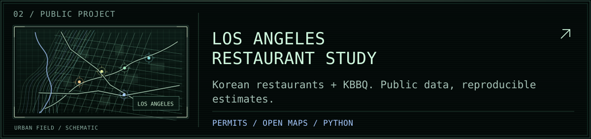
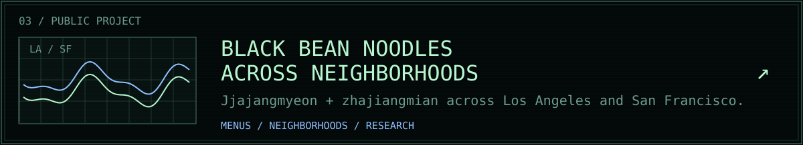
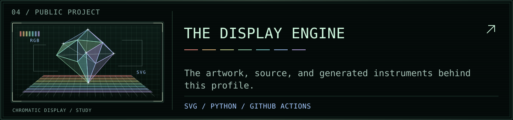
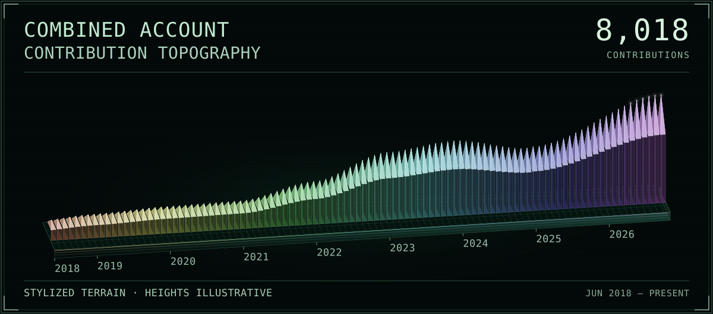

  

  <picture><source media="(max-width: 640px)" srcset="assets/operator-mobile.svg" /></picture>

  <samp>
    <a href="https://github.com/acesava?tab=repositories">REPOSITORIES</a>
    &nbsp; / &nbsp;
    <a href="https://www.linkedin.com/in/ace-savage-41a041190/">LINKEDIN</a>
  </samp>

<a href="https://github.com/acesava/la-korean-restaurants"><picture><source media="(max-width: 640px)" srcset="assets/project-restaurants-mobile.svg" /></picture></a>

<a href="https://github.com/acesava/jjajangmyeon-restaurants"><picture><source media="(max-width: 640px)" srcset="assets/project-noodles-mobile.svg" /></picture></a>

<a href="https://github.com/acesava/acesava"><picture><source media="(max-width: 640px)" srcset="assets/project-display-mobile.svg" /></picture></a>

  

Open the field notes

- [Los Angeles restaurant study](https://github.com/acesava/la-korean-restaurants): reproducible estimates using health permits, open map data, and a Yelp check.
- [Black bean noodles across neighborhoods](https://github.com/acesava/jjajangmyeon-restaurants): restaurant and menu research across Korean and Chinese neighborhoods in Los Angeles and San Francisco.
- [Display source](scripts): the profile's SVG instruments are generated with Python. The contribution landscape refreshes daily with GitHub Actions; it is a snapshot of GitHub activity, not a live feed. Project-panel diagrams are decorative.

