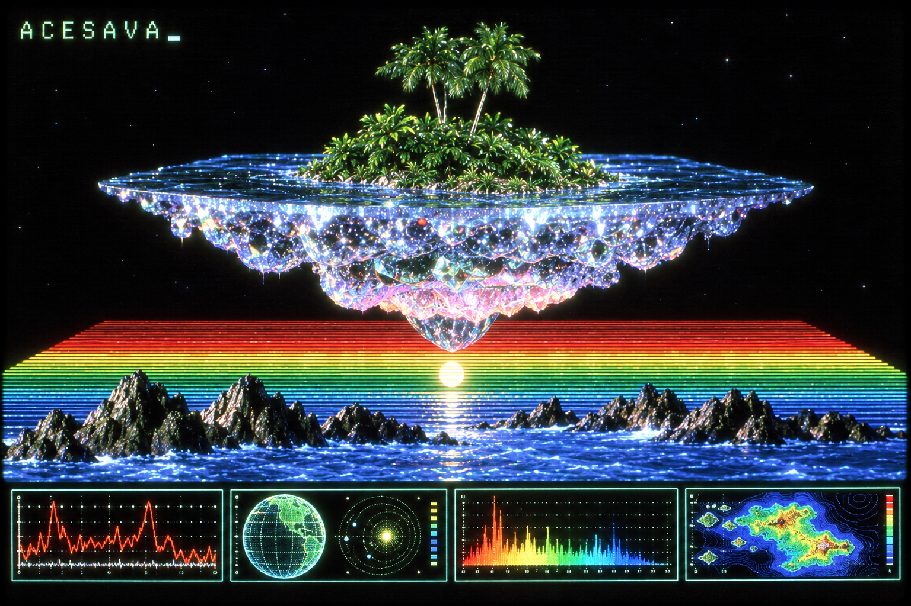
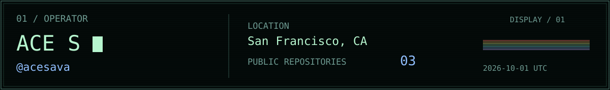

  

  <picture><source media="(max-width: 640px)" srcset="assets/operator-mobile.svg" /></picture>

  <samp>
    <a href="https://github.com/acesava?tab=repositories">REPOSITORIES</a>
    &nbsp; / &nbsp;
    <a href="https://www.linkedin.com/in/ace-savage-41a041190/">LINKEDIN</a>
  </samp>

  <picture><source media="(max-width: 640px)" srcset="assets/contributions-mobile.svg?v=terrain-present" /></picture>

